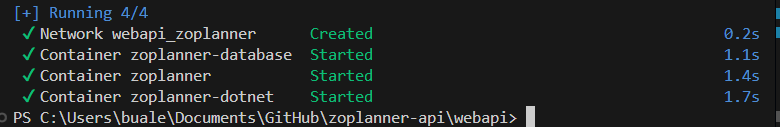

# 3 containers instructions

## Project Structure

```  
 
GitHub/
├── zoplanner-api/          # Repo 1
│   └── webapi/
│       └── docker-compose.yml
└── zoplanner-service/      # Repo 2
    └── zoplannerservice/
        └── Dockerfile

```  

> We need to run all containers from the folder where `docker-compose.yml` is located: `\zoplanner-api\webapi`.
>
> Make sure that you are in the correct folder before run the conteiner from **Spring Boot**.
>
> We can also start the containers from **.Net**. To do so, use the command in terminal to navigate from **zoplanner-service** to **zoplanner-api**

```
cd ..\..\zoplanner-api\webapi
```

# Quick Reference

| Action              | Command                                                             |     |
| ------------------- | ------------------------------------------------------------------- | --- |
| First run           | `mvn clean package -DskipTests && docker-compose up -d --build`     |     |
| Start all           | `docker-compose up -d`                                              |     |
| Stop all            | `docker-compose down`                                               |     |
| Stop + delete data  | `docker-compose down -v`                                            |     |
| Restart all         | `docker-compose restart`                                            |     |
| .NET changes        | `docker-compose up -d --build dotnet-service`                       |     |
| Spring Boot changes | `mvn clean package -DskipTests && docker-compose up -d --build app` |     |
| View logs           | `docker-compose logs -f`                                            |     |
| Check status        | `docker-compose ps`                                                 |     |
# Commands with explanations
## Start All Containers  - it is different if you do first time or not

```bash   
# First run (build Spring Boot JAR first!, this command skipping tests)  
mvn clean package -DskipTestsdocker-compose up -d --build  

# Regular start  
docker-compose up -d 
```  

## Stop Containers  - choose what you need

```bash  
# Stop (keeps data but removing containers)  
docker-compose down  
  
# Stop and delete database data  
docker-compose down -v  
  
# Stop without removing containers  
docker-compose stop   
  
```

## Individual Container Operations

```bash  
# Start specific container  
# Start .net
docker-compose up -d dotnet-service  
# Start Spring Boot
docker-compose up -d app  
# Start only DB
docker-compose up -d zoplanner-database  
  
# Stop specific container  
docker-compose stop dotnet-service  
docker-compose stop app  
  
# Restart specific container  
docker-compose restart dotnet-service  
docker-compose restart app  
```
# Code Changes

### .NET code changed
```bash  
docker-compose up -d --build dotnet-service
```  

### Spring Boot code changed
```bash  
# Build JAR first, then rebuild container  
mvn clean package -DskipTests  
docker-compose up -d --build app  
```  
Spring Boot Dockerfile copies pre-built JAR from `target/`.

### Both projects changed
```bash  
mvn clean package -DskipTestsdocker-compose up -d --build
```  

### Database configuration changed
```bash  
# Warning: Deletes database data!  
docker-compose down -v  
docker-compose up -d --build zoplanner-database  
```  

## Database Persistence

**Data PERSISTS on:**
- `docker-compose down`
- `docker-compose restart`
- `docker-compose stop`
- System reboot

**Data DELETED on:**
- `docker-compose down -v` (removes volumes)
- `docker volume rm zoplanner-data`

### Backup and Restore

```bash  
# Create backup  
docker exec zoplanner-database pg_dump -U postgres -d zoplanner > backup.sql  
  
# Restore from backup  
docker exec -i zoplanner-database psql -U postgres -d zoplanner < backup.sql  
  
# List volumes  
docker volume ls  
```  

## Monitoring

```bash  
# Check status  
docker ps  
docker-compose ps  
  
# View logs  
docker-compose logs -f  
docker-compose logs -f dotnet-service  
docker-compose logs -f app  
docker-compose logs --tail=100 dotnet-service  
  
# Access container shell  
docker exec -it zoplanner-dotnet sh  
docker exec -it zoplanner sh  
docker exec -it zoplanner-database psql -U postgres  
```  

## Testing

```bash  
# .NET API  
curl http://localhost:5027/api/Customer  
curl http://localhost:5027/api/Customer/1  
  
# Spring Boot API  
curl http://localhost:8080/api/customers  
curl http://localhost:8080/api/customers/1  
  
# PostgreSQL  
psql -h localhost -p 5432 -U postgres -d zoplanner  
# or  
docker exec -it zoplanner-database psql -U postgres -d zoplanner  
```  

## Troubleshooting

```bash  
# Check logs for errors  
docker-compose logs app  
docker-compose logs dotnet-service  
  
# Check environment variables  
docker exec zoplanner-dotnet printenv | grep SpringApi  
docker exec zoplanner printenv | grep POSTGRES  
  
# Full clean restart (keeps data)  
docker-compose down  
mvn clean package -DskipTests  
docker-compose up -d --build  
  
# Full clean restart (deletes data)  
docker-compose down -v  
mvn clean package -DskipTests  
docker-compose up -d --build  
```  

## Network Architecture

```  
┌─────────────────────────────────────────────────────────┐  
│           Docker Network: zoplanner (bridge)            │  
│                                                         │  
│  ┌──────────────┐  ┌──────────────┐  ┌──────────────┐ │  
│  │ PostgreSQL   │  │ Spring Boot  │  │  .NET API    │ │  
│  │              │◄─┤              │◄─┤              │ │  
│  │ Port: 5432   │  │ Port: 8080   │  │ Port: 5027   │ │  
│  │              │  │              │  │              │ │  
│  │ Container:   │  │ Container:   │  │ Container:   │ │  
│  │ zoplanner-   │  │ zoplanner    │  │ zoplanner-   │ │  
│  │ database     │  │              │  │ dotnet       │ │  
│  └──────────────┘  └──────────────┘  └──────────────┘ │  
│         ▲                 ▲                  ▲          │  
└─────────┼─────────────────┼──────────────────┼──────────┘  
          │                 │                  │      
          localhost:5432    localhost:8080    localhost:5027
          
```  

**Internal communication (by container name):**
- .NET → Spring Boot: `http://zoplanner:8080/api`
- Spring Boot → PostgreSQL: `jdbc:postgresql://zoplanner-database:5432/...`

**External access (via localhost):**
- PostgreSQL: `localhost:5432`
- Spring Boot: `localhost:8080`
- .NET: `localhost:5027`